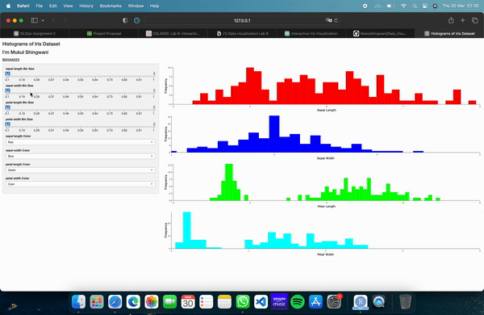
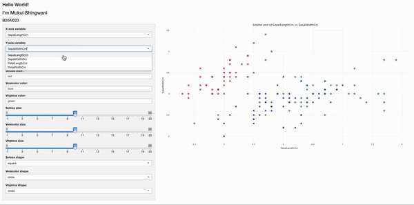
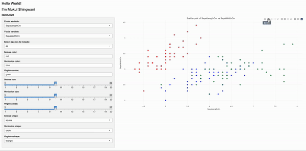
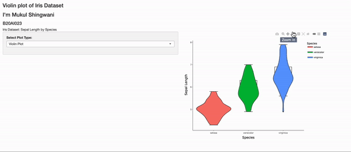
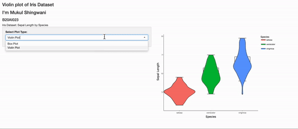

# Data Visualization Lab 8
## Mukul Shingwani
## B20AI023
---

In this lab we were asked to complete the following tasks :-   
Create the following graphics for Iris data available in UCI repository or default repository of R.

-   `Histograms` of all the properties
-   `Scatter plot` of data points with each species in different color
-   `Violin` or `Box plot` for separate species in a single plot

In this graphics add the following interactivity:

1. User can `change` the `bin size` of all the histogram separately
2. User can `change colors` of each histogram separately
3. User can `choose the x-axis and y-axis` for the scatter plot
4. User can `change colors` of different species in scatter plot
5. User can `filter` only `certain species` for the scatter plot
6. User can `change` the `point size` and `shape` for different species in the scatter plot
7. (bonus points) Add `Pan` and `Zoom` to each diagram.
8. (bonus points) Add `resizing` of diagram

---

## **Histogram**
### displaying options for changing colors and bins

### added features like zooming, panning, resizing etc.

## **Scatterplot**
### displaying options for changing axis variable, size, color and shape of marker along with specie selection

### added features like zooming, panning, resizing etc.

## **Violinplot and Box Plot**
### violin plot

### box plot

